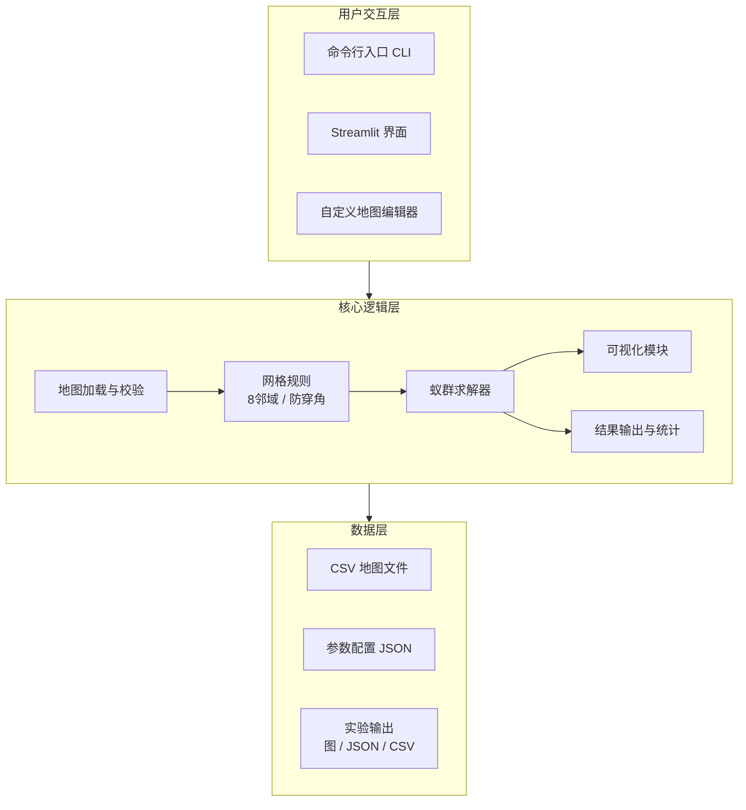
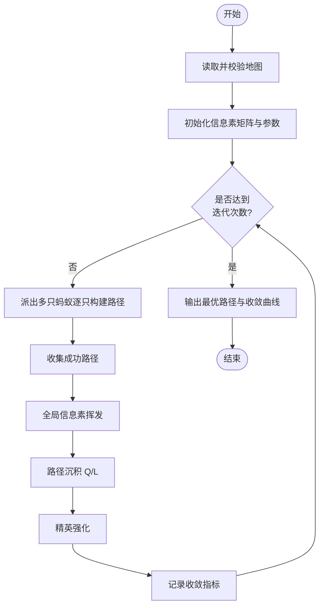
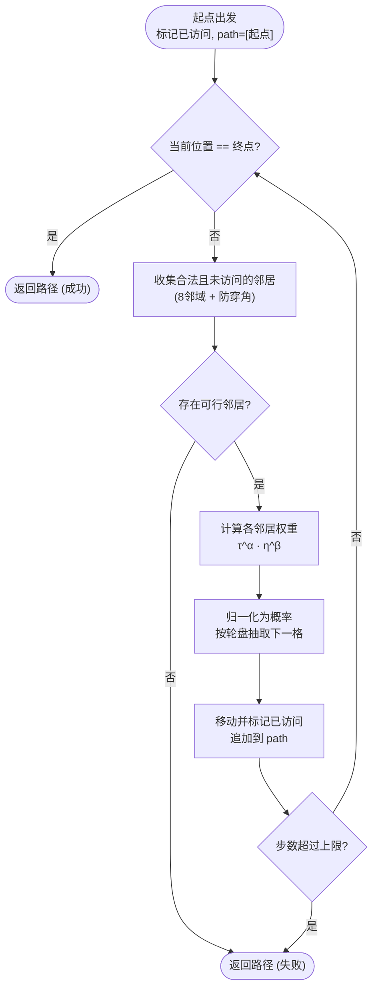

# 基于蚁群算法的栅格路径规划系统设计与实现

## 1. 摘要

路径规划问题是移动机器人研究中的基础问题之一，其核心任务是在给定环境中为机器人寻找一条从起点到终点的可行路径，并在满足避障要求的前提下尽量缩短路径长度、提高搜索效率。随着智能机器人、无人配送、自动驾驶和仓储自动化等应用的发展，路径规划问题已经成为智能系统设计中的重要组成部分。对于课程设计而言，路径规划问题既具有明确的工程目标，又包含典型的算法设计、系统实现和实验分析内容，因此非常适合作为综合性训练题目。

本文围绕“基于蚁群算法的栅格路径规划系统设计与实现”这一题目，设计并实现了一个完整的课程设计项目。系统以 `CSV` 栅格地图文件作为输入，能够读取起点、终点和障碍物信息，并在二维静态环境中利用蚁群算法完成路径搜索。为了便于展示和分析，系统同时提供了命令行运行方式和基于 Streamlit 的图形交互界面，支持参数调节、地图选择、路径结果显示和实验结果导出。

在算法层面，本文采用基于节点信息素的蚁群算法建模方式，在传统全局信息素挥发和路径沉积机制的基础上，引入了局部信息素更新和精英强化策略，以增强算法在复杂地图上的搜索能力和结果稳定性。与此同时，为了更好地观察算法在不同参数和不同地图下的行为，系统记录了历史最优路径长度、本轮最优路径长度、本轮平均路径长度以及每轮成功路径数等多类收敛指标，并将这些结果转化为可视化曲线。

在实验层面，本文不仅完成了系统功能测试，还围绕蚂蚁数量、迭代次数以及信息素参数设计了多组真实实验。实验结果表明，该系统能够在多类可解地图上稳定找到路径，并且在部分分析地图上表现出较典型的“先探索、后改进”的收敛过程。整体来看，本课程设计已经完成了从问题分析、算法设计、系统实现到实验验证的完整闭环，达到了课程设计的预期目标。

**关键词：** 蚁群算法；栅格地图；路径规划；可视化；课程设计

---

## 2. 绪论

### 2.1 课题背景

路径规划问题广泛存在于机器人导航、物流调度、游戏 AI、无人车控制以及工业自动化等场景中。无论是仓库中的自动搬运机器人，还是道路中的自动驾驶车辆，都必须在复杂环境中根据起点、终点和障碍物分布规划出一条可行路径。从学术角度看，路径规划问题属于典型的优化问题；从工程角度看，它又具有明显的系统实现特征，因此一直是人工智能与机器人领域的重要研究方向。

在众多环境表示方法中，栅格地图是一种非常常见的离散化表示方式。其基本思想是将二维平面划分为规则的小网格，每个网格单元用一个离散值表示当前区域的状态，例如空地、障碍物、起点或终点。这种表示方式实现简单、直观清晰，便于通过程序读取和处理，也便于结合搜索算法与可视化工具进行课程设计开发。

从算法角度看，路径规划可以通过多种方法求解，例如最短路径算法、启发式搜索算法、遗传算法、粒子群算法以及蚁群算法等。不同方法各有特点，其中蚁群算法通过模拟蚂蚁觅食过程中释放与感知信息素的机制，实现个体分布式搜索和群体协作优化。相比单一路径搜索方法，蚁群算法在处理复杂路径空间时具有较强的并行探索能力，因此非常适合作为课程设计的核心算法。

### 2.2 课题意义

本课题的意义体现在理论学习与工程实践两个层面。首先，在理论层面，本项目有助于理解蚁群算法的基本思想，包括状态转移概率、信息素挥发、路径沉积、局部更新以及精英强化等关键机制。其次，在实现层面，本项目要求从地图输入、算法求解、图形可视化到实验统计构建一个完整系统，这有助于训练面向实际问题的工程设计能力。

对于课程设计来说，一个好的课题不仅要“能跑起来”，还要能体现算法思想、系统结构和实验分析。本项目之所以具有较强的训练价值，正是因为它不只停留在算法实现层面，而是进一步扩展到了参数调节、交互界面、收敛曲线展示、实验结果汇总和文档整理等内容。因此，它能够较全面地反映课程设计的综合能力要求。

### 2.3 课题目标

根据课程设计题目要求，本项目需要实现一个能够读取栅格地图并完成路径规划的系统。更具体地说，系统应当完成以下任务：从外部地图文件中读取起点、终点和障碍物信息；利用蚁群算法规划可行路径；允许用户调整关键算法参数；通过图形界面展示地图、路径和收敛结果；并通过实验验证算法在不同参数和不同地图下的表现。

因此，本文并不是单纯实现一个算法函数，而是围绕路径规划问题设计一个可运行、可测试、可展示、可分析的系统。只有当这几个方面形成闭环，才能说明课程设计真正完成。

### 2.4 本文主要工作

围绕上述目标，本文完成了以下几方面工作。首先，设计并实现了基于 `CSV` 的栅格地图输入格式，以及与之对应的地图解析与校验模块。其次，实现了基于 8 邻域搜索规则的网格路径规划框架，并在此基础上构建了蚁群算法求解器。然后，为了提升系统的可解释性与实验价值，增加了局部信息素更新、精英强化、多条收敛指标记录以及结果导出与统计汇总机制。在交互方面，除了支持选择内置地图，还在 Streamlit 界面中实现了自定义地图编辑器：用户可以先设置地图尺寸，再用鼠标拖动的方式在方格画布上绘制障碍、起点和终点，并将绘制结果保存为标准 `CSV` 地图以供复用。最后，基于命令行与 Streamlit 双入口，构建了完整的人机交互界面和实验展示流程。

在实验部分，本文还完成了多组参数实验，并用真实结果分析蚂蚁数量、迭代次数和信息素参数对路径长度、收敛速度与成功路径数量的影响。通过这些工作，项目已经具备了课程设计答辩和报告撰写所需的主要内容。

---

## 3. 需求分析

### 3.1 功能需求分析

本课题要求系统能够围绕“地图输入、算法求解、结果展示、参数调节”几个核心环节展开。因此，在功能需求上，系统至少需要具备以下能力：第一，能够从文件中读取地图，并正确识别空地、障碍物、起点和终点；第二，能够根据地图数据构建搜索空间，并执行蚁群算法路径规划；第三，允许用户调整关键参数，以观察不同设置对算法行为的影响；第四，能够将最终路径、路径长度、路径坐标以及收敛过程直观展示出来。

在实际实现中，这些需求又进一步细化为：地图文件解析、路径求解、参数配置、可视化展示、实验结果导出和汇总统计等多个子模块。此外，为了降低使用门槛、提升交互体验，系统还在界面层提供了自定义地图绘制能力，使用户无需手工编辑 `CSV` 文件即可构造新地图。只有这些功能模块都具备，系统才能真正满足题目要求，而不仅仅是“写出一个能运行的算法函数”。

### 3.2 输入需求分析

系统输入主要包括地图输入和参数输入两类。地图输入部分采用 `CSV` 数字栅格格式，这是因为该格式简单、清晰，便于课程设计中手工构造地图，也便于程序直接读取。每个网格单元使用数字来表示语义，其中 `0` 表示空地，`1` 表示障碍物，`2` 表示起点，`3` 表示终点。为了保证输入合法，系统还需要额外校验地图是否是规则矩形、是否只包含合法取值，以及起点终点是否唯一存在。除了直接读取已有的 `CSV` 文件外，系统还支持在界面中先设置地图尺寸，再用鼠标拖动绘制障碍、起点和终点，并将绘制结果保存为同样格式的 `CSV` 文件，从而把“手工构造地图”这一过程也纳入系统内部。

参数输入部分则围绕蚁群算法的核心控制变量展开。系统需要支持蚂蚁数量、迭代次数、信息素重要程度、启发函数重要程度、全局挥发率、局部挥发率、信息素沉积常数、精英强化权重以及随机种子等参数。之所以把参数输入作为需求的一部分，是因为课程设计不仅要求“跑出结果”，更要求通过参数调整理解蚁群算法的行为规律。

### 3.3 输出需求分析

从用户视角看，系统输出不应局限于“找到一条路径”这么简单。课程设计需要展示的不仅是最终答案，还包括过程特征与实验分析结果。因此，系统输出至少应包括：是否找到路径、路径长度、路径坐标、最优出现轮次、运行耗时以及若干类型的收敛曲线。此外，为了便于后续整理实验材料，系统还应当输出结构化结果文件、曲线图片和路径文本文件。

这些输出一部分面向界面展示，一部分面向实验记录和报告撰写。前者服务于交互使用，后者服务于课程设计文档和答辩材料。因此，在系统设计阶段就必须把输出需求考虑进去，而不能等功能实现后临时补救。

### 3.4 环境需求分析

本系统使用 Python 语言实现，依赖 NumPy 进行数据处理，Matplotlib 进行图形绘制，Streamlit 进行界面展示。在运行环境上，项目实验统一使用 `conda` 虚拟环境 `aco_path`，这样做的好处是能够保证依赖版本统一，避免因为解释器环境不同导致运行结果不一致。

从开发角度看，系统还需要兼容 `PyCharm`、`VS Code`、命令行和 Streamlit 的不同启动方式，因此项目在结构上保留了根入口文件和脚本入口文件，并对 `src` 布局进行了适配。环境需求分析的目的，就是在设计早期明确“系统不仅要能开发，还要能稳定运行和重复验证”。

---

## 4. 系统总体设计

### 4.1 项目目录结构设计

本项目采用分层清晰的目录组织方式，将配置、数据、文档、脚本、源码和测试分离。这样的结构设计有助于提高可维护性，也方便后续继续扩展。`config/` 用于存放默认参数配置；`data/` 用于存放地图与实验输出；`docs/` 用于存放参考分析、技术设计、运行手册和实验结果；`scripts/` 用于存放启动和工具脚本；`src/aco_path_planning/` 用于存放核心代码；`tests/` 用于存放自动化测试。

这种结构设计并不是简单地把文件分开放置，而是有明确分工的。配置与数据不混在源码里，文档与测试也都有独立位置，这让项目的整体组织更符合工程实践，也让课程设计报告中的结构描述更清晰。

### 4.2 系统总体结构设计

从逻辑上看，系统可以分成六个模块：地图加载模块、网格规则模块、蚁群算法求解模块、可视化模块、结果输出与统计模块、用户交互模块。地图加载模块负责把外部文件转换成内部可处理的数据结构；网格规则模块负责定义可行移动与路径代价；求解模块负责真正的路径搜索；可视化模块负责路径和曲线展示；输出模块负责结果落盘与汇总；交互模块负责 Streamlit 和命令行的用户接口。其中交互模块除了选择已有地图和调节参数外，还包含一个自定义地图编辑器，允许用户直接在界面中绘制地图，再把绘制结果交给地图加载逻辑统一校验。

这种模块化设计的好处在于，算法与界面、输入与输出、数据与表现相互独立。即使后续需要更换界面、增加新的实验脚本、或把算法替换成边信息素版本，也不需要推翻整个项目结构。

**图 4-1：系统总体架构图**

系统按「用户交互层 → 核心逻辑层 → 数据层」自上而下分为三层，上层调用下层、下层向上回传结果，各层内部模块职责单一、相互解耦。



### 4.3 系统流程设计

系统运行时首先读取地图文件，并完成格式和内容校验。随后根据参数配置初始化信息素矩阵和算法状态，并在多轮迭代中让多只蚂蚁进行路径搜索。每轮搜索结束后，系统根据成功路径执行信息素挥发、普通沉积和精英强化，同时记录历史最优、本轮最优、本轮平均和成功路径数量等指标。最终，系统输出最优路径、路径长度、路径坐标、曲线图以及结构化实验结果文件。

与只返回“最短路径结果”的简单程序相比，这个流程更加完整。它不仅关注求解结果，还兼顾实验可复现性和结果可分析性，这也是课程设计系统和单一算法脚本之间的重要区别。

**图 4-2：系统整体运行流程图**

系统主流程是一个「读图 → 初始化 → 多轮迭代 → 输出」的闭环，其中迭代循环是算法的核心，每轮内部依次完成路径构建、信息素更新与指标记录。



---

## 5. 关键技术与算法设计

### 5.1 栅格地图表示方法

在本系统中，二维环境通过栅格地图表示。每个格子都是一个最小单位，系统通过读取 `CSV` 文件来构建整张地图。由于路径规划目标并不是连续控制，而是离散状态下的可行路径搜索，因此栅格地图能够在表达能力与实现复杂度之间取得良好平衡。相比几何建模，栅格地图更加适合课程设计中的快速构造、程序解析和图形展示。

地图加载完成后，系统将其转换为 `GridMap` 数据结构。这个结构统一封装了地图矩阵、起点、终点和来源路径等信息，从而为后续的搜索和可视化提供了统一接口。这样做也使得地图处理逻辑和算法逻辑彼此解耦，便于维护。

### 5.2 8 邻域与防穿角规则

为了使路径既具有一定灵活性，又能保持实现简单，系统采用 8 邻域搜索方式。也就是说，机器人在每一步都可以考虑向上、下、左、右和四个对角方向移动。直线方向的代价设为 `1.0`，对角方向的代价设为 `sqrt(2)`，这与常见栅格路径规划中的距离近似保持一致。

仅使用 8 邻域还不够，因为如果直接允许任意对角移动，就可能出现“穿过障碍物角点”的不合理情况。为了解决这一问题，系统在网格规则模块中加入了防穿角约束：只有当对角方向两侧相邻的正交格也可通行时，才允许执行该对角移动。这个规则保证了路径在视觉上和几何上都更加合理。

### 5.3 蚁群算法整体流程

蚁群算法的核心思想是通过多只蚂蚁在地图上的并行搜索，逐步强化较优路径上的信息素，从而提高后续搜索选择优质路径的概率。在本系统中，每轮迭代会生成一定数量的蚂蚁，从起点出发，以概率方式选择下一步位置，直到到达终点或搜索失败。所有成功路径都会参与信息素更新，而全局最优路径还会被进一步强化。

这一过程既保留了蚁群算法的随机探索特性，也体现了信息素驱动的集体学习能力。换句话说，系统不是让单只蚂蚁“算出最优解”，而是通过多轮、多只蚂蚁的群体协作逐步收敛到较优结果。

### 5.4 状态转移概率

在每一步选择下一个节点时，蚂蚁会综合考虑信息素强度和启发信息。系统首先为当前格子收集所有“合法且未访问过”的邻居，再为每个候选邻居 $j$ 计算一个非归一化权重：

$$
weight(j)=\tau(j)^{\alpha}\cdot\eta(j)^{\beta}
$$

其中，$\tau(j)$ 表示候选节点上的信息素强度，$\eta(j)$ 表示该节点相对于终点的启发信息，$\alpha$ 和 $\beta$ 分别控制两者的影响程度。把所有候选邻居的权重归一化后，就得到了蚂蚁选择各邻居的概率：

$$
p(j)=\frac{\tau(j)^{\alpha}\cdot\eta(j)^{\beta}}{\sum_{k\in N}\tau(k)^{\alpha}\cdot\eta(k)^{\beta}}
$$

启发函数采用“到终点距离的倒数”形式，即 $\eta(j)=1/\big(d(j,goal)+\varepsilon\big)$，其中 $d(\cdot)$ 为 8 邻域下的对角线距离（octile 距离），$\varepsilon$ 是一个很小的正数，用于避免当候选格恰好是终点时出现除零。这意味着越接近终点的位置，启发值越大，理论上越容易被优先选择。

在工程实现上还做了两点数值稳健性处理：一是信息素强度取 $\tau=\max(\tau,10^{-12})$，避免某格信息素被挥发到接近 0 后再做幂运算时取到 0；二是当所有候选权重之和非有限或不大于 0 时（极端数值情况），直接退化为在候选邻居间均匀选择，保证算法不会因为数值问题而崩溃。

这种设计体现了蚁群算法中的典型思想：信息素 $\tau$ 代表“历史经验”，启发函数 $\eta$ 代表“即时方向判断”。当 $\alpha$ 偏大时算法更依赖群体积累的经验，当 $\beta$ 偏大时算法更偏向贪心地朝终点前进。本系统默认取 $\alpha=1.0$、$\beta=4.0$，即在保留信息素学习能力的同时，让方向启发占据相对主导，从而在栅格地图上获得较快的初始收敛。

### 5.5 信息素挥发与路径沉积

为了避免信息素无限累积并造成搜索早熟，系统在每轮结束后先对所有可通行节点执行全局挥发，再对成功路径进行信息素沉积。挥发操作按统一比例削弱所有可通行格上的旧信息：

$$
\tau \leftarrow (1-\rho)\cdot\tau
$$

其中 $\rho$ 为全局挥发率（默认 $0.3$），它越大表示“遗忘”越快。随后，本轮每一条成功到达终点的路径都会沿其经过的格子沉积信息素，沉积量与路径长度成反比：

$$
\Delta\tau = \frac{Q}{L}
$$

其中 $Q$ 为信息素沉积常数（默认 $100$），$L$ 为该条路径的长度。路径越短，$\Delta\tau$ 越大，因此短路径在后续迭代中会逐渐更具吸引力。需要强调的是，挥发只作用于可通行格（通过 `walkable_mask` 掩码限定），障碍格始终保持信息素为 0，从机制上保证蚂蚁不会被引导到不可通行区域。

这一机制本质上是一种动态平衡：挥发负责“遗忘”，沉积负责“学习”。如果只有沉积没有挥发，早期结果会被无限放大；如果只有挥发没有沉积，算法又无法形成有效记忆。因此，两者缺一不可。

### 5.6 局部信息素更新

传统蚁群算法只在一轮搜索结束后做全局更新，而本系统进一步加入了局部信息素更新。也就是说，单只蚂蚁在完成一次搜索后，会对其走过的每个格子立即执行一次局部调整，把信息素往初始水平 $\tau_0$ 回拉一部分：

$$
\tau \leftarrow (1-\xi)\cdot\tau + \xi\cdot\tau_0
$$

其中 $\xi$ 为局部挥发率（默认 $0.05$，取 0 时关闭该机制），$\tau_0$ 为初始信息素。这样做的目的并不是直接提高这条路径的吸引力，而是避免“刚被走过的路径立刻被后续蚂蚁无限追随”，从而保留一定的探索空间。

需要说明的是，本系统的局部更新是在蚂蚁**走完整条路径之后**对全路径施加的，相比经典 ACS 中“每走一步即时削弱当前边”的做法做了简化，目的是在保留探索促进作用的同时降低实现复杂度。从实验角度看，局部更新有助于减弱过早集中在少数路径上的风险，使得算法在复杂地图上更有可能继续探索到更优路径。

### 5.7 精英强化

除了普通的成功路径沉积外，系统还加入了精英强化策略。所谓精英强化，就是在每轮普通沉积结束后，若当前已经存在全局最优路径 $P^{*}$，则对这条路径再额外沉积一次信息素：

$$
\Delta\tau_{elite} = w \cdot \frac{Q}{L^{*}}
$$

其中 $w$ 为精英权重（默认 $2.0$），$L^{*}$ 为当前全局最优路径的长度。这相当于让全局最优路径在普通沉积之外再获得 $w$ 倍的“额外强化”，从而让已经验证过更优的路径在后续轮次中得到更强巩固，加快整体收敛。

但精英强化也不是越强越好。若权重设置过大，算法可能会过早偏向当前最优路径，导致搜索陷入次优解。因此系统把精英强化做成了可配置开关（`elite_enabled`），并允许调节精英权重（`elite_weight`），以便在实验中观察不同设置下的影响。

### 5.8 收敛指标设计

为了避免只用单一指标分析算法，系统设计了多条收敛指标。`history_best_length` 用于记录历史最优路径长度，反映全局最优是否继续改进；`history_iteration_best_length` 用于记录每轮最优路径长度，反映当前轮中最好的搜索结果；`history_iteration_mean_length` 用于记录每轮平均路径长度，反映群体整体搜索质量；`history_success_count` 则用于记录每轮成功到达终点的蚂蚁数量，反映搜索稳定性和覆盖率。

这几条指标结合起来，比单独看一条历史最优曲线更有解释力。尤其是在某些地图上，历史最优很快变平，但本轮最优、本轮平均和成功路径数仍然会继续变化，这说明算法其实还在动态调整。

### 5.9 默认参数汇总

为了便于对照，下表汇总了系统的全部算法参数及其默认取值（定义在 `config/aco_defaults.json` 与 `AcoParams` 中）。需要区分的是，实验章节中的 `baseline` 是人工设置的对照参数组，并不等同于系统默认参数；具体实验取值见 `docs/04_EXPERIMENT_RESULTS.md`。

| 参数 | 符号 | 默认值 | 含义 |
| --- | --- | --- | --- |
| `ant_count` | — | 50 | 每轮派出的蚂蚁数量 |
| `iterations` | — | 100 | 总迭代轮数 |
| `alpha` | $\alpha$ | 1.0 | 信息素重要程度 |
| `beta` | $\beta$ | 4.0 | 启发函数重要程度 |
| `evaporation_rate` | $\rho$ | 0.3 | 全局信息素挥发率 |
| `pheromone_deposit_q` | $Q$ | 100.0 | 信息素沉积常数 |
| `initial_pheromone` | $\tau_0$ | 1.0 | 可通行格初始信息素 |
| `local_evaporation_rate` | $\xi$ | 0.05 | 局部信息素回拉系数 |
| `elite_enabled` | — | true | 是否启用精英强化 |
| `elite_weight` | $w$ | 2.0 | 精英路径额外沉积权重 |
| `random_seed` | — | 42 | 随机种子，保证结果可复现 |

所有参数都在 `AcoParams.validate()` 中做了取值校验，例如要求蚂蚁数与迭代次数为正、$\alpha$ 与 $\beta$ 非负、挥发率落在 $[0,1)$ 区间等；非有限数值（`NaN`/`inf`）、非整数随机种子以及非布尔的精英强化开关也会被拒绝。非法参数会在求解开始前直接抛出异常，从而避免在错误配置下浪费整次运行。

---

## 6. 系统详细设计与实现

### 6.1 地图加载模块设计

地图加载模块负责整个系统的数据入口。该模块读取 `CSV` 文件，将每行每列转化为数值矩阵，并进一步提取起点、终点和障碍物信息。在实现过程中，模块不仅负责读取数据，还承担输入校验责任，例如判断地图是否为规则矩形、是否包含非法值、是否存在且仅存在一个起点和终点。

这种设计的好处是，把所有输入合法性问题集中在一个模块内解决。这样后续算法部分就可以默认“输入一定是合法地图”，从而简化求解逻辑。

### 6.2 数据模型设计

系统中的 `GridMap`、`AcoParams` 和 `PlanningResult` 三个核心数据结构承担了“统一接口”的作用。`GridMap` 用来表达地图环境，`AcoParams` 用来承载参数配置，`PlanningResult` 用来保存最终路径与收敛历史。这种数据结构化设计使不同模块之间的协作更加清晰，也降低了参数和结果传递过程中的混乱。

特别是 `PlanningResult`，它不仅保存最终路径和长度，还保存实验分析所需的多条收敛历史，这使得算法结果可以直接供可视化、汇总和报告使用。

### 6.3 求解器实现

求解器是整个系统的核心。其运行过程可以概括为：初始化信息素矩阵、逐轮生成蚂蚁、收集成功路径、更新全局最优、执行信息素挥发和沉积、执行局部更新与精英强化，并在每轮结束后记录统计指标。由于每轮都可能有多只蚂蚁成功到达终点，因此系统不是简单返回一条路径，而是保留了更完整的过程信息。

这种实现方式使得项目不仅能“给出答案”，还能解释这个答案是如何得到的，这一点对课程设计和实验分析都很重要。下面结合关键代码逐段说明求解器的实现思路。

#### 6.3.1 信息素矩阵初始化

求解开始时，先校验参数，再根据随机种子建立可复现的随机数发生器，并初始化信息素矩阵：

```python
def solve_path(grid_map: GridMap, params: AcoParams) -> PlanningResult:
    params.validate()
    started_at = time.perf_counter()

    rng = np.random.default_rng(params.random_seed)
    pheromone = np.zeros((grid_map.rows, grid_map.cols), dtype=float)
    pheromone[grid_map.walkable_mask] = params.initial_pheromone
```

这里有两点值得注意。第一，信息素矩阵与地图同形，但只有可通行格（`walkable_mask` 为真的位置）被赋予初始信息素，障碍格始终保持为 0，这从数据结构层面保证了蚂蚁不会被引导到障碍上。第二，所有随机选择都由 `rng` 统一驱动，因此只要随机种子相同，整次实验的结果就完全可复现，这是后续做参数对照实验的前提。

#### 6.3.2 迭代主循环

主循环的每一轮都会派出 `ant_count` 只蚂蚁，逐只构建路径并收集成功者：

```python
for iteration in range(1, params.iterations + 1):
    successful_paths: list[tuple[list[Coordinate], float]] = []

    for _ in range(params.ant_count):
        candidate_path, reached_goal = _build_ant_path(grid_map, pheromone, params, rng)
        _apply_local_pheromone_update(...)

        if not reached_goal:
            continue

        candidate_length = path_length(candidate_path)
        successful_paths.append((candidate_path, candidate_length))
        total_successful_paths += 1

        if candidate_length < best_length:
            best_path = candidate_path
            best_length = candidate_length
            best_iteration = iteration
```

可以看到，每只蚂蚁无论成功与否都会触发一次局部信息素更新，而只有真正到达终点的蚂蚁才会被纳入 `successful_paths` 并参与本轮的全局沉积；同时，一旦发现更短的路径就立即刷新全局最优，并记录它出现在第几轮。这样设计让“全局最优更新”与“逐轮统计”彻底分离，逻辑清晰。

#### 6.3.3 全局挥发、沉积与精英强化

一轮中所有蚂蚁都走完后，才统一执行信息素的挥发、沉积与精英强化：

```python
pheromone[grid_map.walkable_mask] *= 1.0 - params.evaporation_rate

for candidate_path, candidate_length in successful_paths:
    deposit = params.pheromone_deposit_q / max(candidate_length, 1e-9)
    for row, col in candidate_path:
        pheromone[row, col] += deposit

if params.elite_enabled and best_path:
    elite_deposit = (
        params.elite_weight * params.pheromone_deposit_q / max(best_length, 1e-9)
    )
    for row, col in best_path:
        pheromone[row, col] += elite_deposit
```

第一行用 NumPy 掩码一次性完成对所有可通行格的挥发，对应公式 $\tau\leftarrow(1-\rho)\tau$；随后对每条成功路径按 $Q/L$ 沉积，路径越短沉积越多；最后若开启精英策略，则对全局最优路径再追加 `elite_weight` 倍的沉积。代码中用 `max(length, 1e-9)` 兜底，避免长度为 0 时除零。

#### 6.3.4 收敛指标记录与结果封装

每轮末尾会把当轮的统计量追加到各条历史曲线中：

```python
if successful_paths:
    iteration_lengths = [length for _, length in successful_paths]
    history_iteration_best_length.append(min(iteration_lengths))
    history_iteration_mean_length.append(sum(iteration_lengths) / len(iteration_lengths))
else:
    history_iteration_best_length.append(math.inf)
    history_iteration_mean_length.append(math.inf)

history_best_length.append(best_length)
history_success_count.append(len(successful_paths))
```

当某轮没有任何蚂蚁成功时，本轮最优与本轮均值记为无穷大（可视化时会被转成 `NaN` 断开曲线），而历史最优则保持上一轮的值不变。所有迭代结束后，求解器把最优路径、长度、最优出现轮次、四条历史曲线、成功路径总数和运行耗时一并封装进 `PlanningResult` 返回，供界面、可视化和结果导出统一使用。

### 6.4 蚂蚁路径构建与状态转移实现

**图 6-1：单只蚂蚁路径构建流程图**

单只蚂蚁在一次搜索中的决策循环如下：每一步先判断是否到达终点，再从「合法且未访问」的邻居中按 $\tau^{\alpha}\cdot\eta^{\beta}$ 概率抽取下一格；当无可行邻居或步数超过上限时，本次搜索失败返回。



单只蚂蚁的搜索过程由 `_build_ant_path` 实现。蚂蚁从起点出发，维护一个已访问集合避免原地兜圈，并在每一步从“合法且未访问”的邻居中按概率选择下一格：

```python
def _build_ant_path(grid_map, pheromone, params, rng):
    current = grid_map.start
    goal = grid_map.goal
    visited = {current}
    path = [current]
    max_steps = grid_map.rows * grid_map.cols

    for _ in range(max_steps):
        if current == goal:
            return path, True

        feasible_neighbors = [
            (coordinate, move_cost)
            for coordinate, move_cost in get_neighbors(grid_map, current)
            if coordinate not in visited
        ]
        if not feasible_neighbors:
            return path, False

        weights = _calculate_weights(...)
        next_index = int(rng.choice(len(feasible_neighbors), p=weights))
        next_coordinate = feasible_neighbors[next_index][0]

        path.append(next_coordinate)
        visited.add(next_coordinate)
        current = next_coordinate

    return path, current == goal
```

这里体现了三个关键设计：其一，用 `max_steps = rows × cols` 作为步数上限，保证即使陷入复杂区域也一定会在有限步内结束，不会死循环；其二，当某一步没有任何可走邻居时（被障碍或已访问格包围），蚂蚁直接判定本次搜索失败并返回，这是网格 ACO 中常见的“此路不通即放弃”策略，它解释了为什么在迷宫、狭窄通道等难图上每轮成功蚂蚁数会偏低；其三，下一步严格通过 `rng.choice(..., p=weights)` 按概率抽取，从而在“跟随信息素”和“随机探索”之间自然平衡。

候选邻居的权重由 `_calculate_weights` 计算，它把 5.4 节的状态转移公式落到了代码上：

```python
def _calculate_weights(feasible_neighbors, goal, pheromone, alpha, beta):
    raw_weights = np.zeros(len(feasible_neighbors), dtype=float)
    for index, (coordinate, _) in enumerate(feasible_neighbors):
        row, col = coordinate
        tau = max(pheromone[row, col], 1e-12)
        eta = 1.0 / (distance_to_goal(coordinate, goal) + 1e-6)
        raw_weights[index] = (tau ** alpha) * (eta ** beta)

    total_weight = float(np.sum(raw_weights))
    if not math.isfinite(total_weight) or total_weight <= 0:
        return np.full(len(feasible_neighbors), 1.0 / len(feasible_neighbors))
    return raw_weights / total_weight
```

其中 $\tau$ 取自信息素矩阵并用 $10^{-12}$ 兜底防止幂运算取零，$\eta$ 用“到终点的 octile 距离加微小量再取倒数”表示方向启发。每个候选的原始权重为 $\tau^{\alpha}\cdot\eta^{\beta}$，归一化后即为选择概率。最后一段是数值稳健性兜底：当权重和异常（非有限或非正）时退化为均匀分布，确保 `rng.choice` 始终能拿到合法的概率向量。

#### 6.4.1 防穿角约束的实现

8 邻域移动的合法性判断集中在网格规则模块。对角移动时，必须保证其两侧的正交格也可通行，否则禁止该移动，从而避免“贴着障碍角点斜穿”这种几何上不合理的路径：

```python
def _can_move_diagonally(grid_map, current, nxt):
    current_row, current_col = current
    next_row, next_col = nxt
    adjacent_one = (current_row, next_col)
    adjacent_two = (next_row, current_col)
    return is_walkable(grid_map, adjacent_one) and is_walkable(grid_map, adjacent_two)
```

这段判断被 `get_neighbors` 在生成对角邻居时调用，因此防穿角约束对整个求解过程是透明且强制的——蚂蚁根本不会把“穿角”当成一个候选动作。

### 6.5 地图元数据与界面说明

为了让用户在界面中不只是看到一串文件名，系统额外设计了地图元数据模块。每张地图都有展示名、地图类别、简要特点说明、预期可解性以及起点终点信息。通过这一模块，Streamlit 界面可以在“地图信息”区域直接解释当前地图属于什么类型、适合观察什么现象，这使得项目的可用性和可展示性明显提高。

**截图 6-1：Streamlit 主界面**

说明：实际成稿时应补入 Streamlit 主页面整体布局截图，内容包括左侧地图选择与算法参数调节侧栏，以及中间地图信息与路径结果展示区。当前仓库尚未纳入 `docs/images/` 截图资源。

### 6.6 自定义地图编辑器实现

除了从文件读取预置地图外，系统还在 Streamlit 界面中提供了自定义地图编辑器，使用户可以直接在网页上绘制地图。其设计思路是把"编辑器交互"与"地图核心逻辑"分离：界面层只负责接收鼠标操作和展示画布，而画笔上色、起终点唯一性约束、笔画栅格化、命名和保存等核心逻辑都集中在独立的逻辑模块中，从而既保证了功能可单独测试，又避免界面代码与算法数据结构耦合。

在交互上，用户先设置地图行列尺寸生成空白画布，再从障碍、起点、终点、擦除四种画笔中选择一种，按住鼠标在画布上拖动绘制。系统采用绘图组件的自由绘制模式采集笔画，并在松开鼠标后将笔画落在画布上的像素区域栅格化为"被划过的格子集合"，再按当前画笔统一着色。其中障碍与擦除笔画会作用到划过的每一个格子，而起点和终点由于全图唯一，即使笔画划过多格也会自动收敛为一个代表格。绘制完成且满足"恰好一个起点和一个终点"的条件后，地图既可以直接用于路径规划，也可以保存为 `CSV` 文件并在示例地图来源中复用。保存时若用户填写名称则使用该名称，遇到同名文件会自动追加序号，避免覆盖已有地图；若留空则按时间戳和序号自动命名。

需要说明的是，所采用的绘图组件较为陈旧，与新版 Streamlit 在图像处理接口上存在不兼容。系统在界面模块启动时通过一个兼容垫片对该接口的位置与签名做了适配，并在组件不可用或运行期调用失败时自动回退到逐格点击的绘制方式，从而在获得拖动绘制体验的同时保证了功能的健壮性。

**截图 6-2：自定义地图编辑器界面**

说明：实际成稿时应补入自定义地图编辑器截图，内容包括画笔选择、尺寸设置、方格画布、地图命名与保存按钮。当前仓库尚未纳入对应截图资源。

### 6.7 可视化模块实现

可视化模块负责地图绘制、路径绘制和曲线绘制。地图图中会显示障碍物、起点、终点以及最终路径；曲线图则分别展示历史最优、本轮最优与平均路径长度以及成功路径数量。这样一来，系统既能展示最终答案，也能展示算法过程。

尤其是在课程设计场景中，曲线比单纯输出路径坐标更容易解释算法行为，因此可视化模块具有很强的教学与展示价值。

**截图 6-3：路径规划结果图**

说明：实际成稿时应补入一张可解地图的求解结果图，灰底网格上应标出障碍、起点、终点，并用折线画出最终最优路径。当前仓库尚未纳入对应截图资源。

**截图 6-4：收敛曲线图**

说明：实际成稿时应补入历史最优路径长度曲线、本轮最优/平均长度对比曲线和成功路径数曲线，用以展示算法的收敛过程。当前仓库尚未纳入对应截图资源。

### 6.8 输出与汇总实现

系统支持把实验输出保存为一组文件，包括标准 JSON、路径图、历史最优收敛图、本轮最优/平均长度图、成功路径数图和文本路径文件。对于无解地图，无穷大路径长度会在 JSON 中规范化为 `null`，避免产生非标准 `Infinity`。进一步地，汇总脚本能够从所有结果文件中提取关键指标和主要算法参数，生成统一的 `summary.csv`，这使得参数实验结果可以直接进入课程设计文档和答辩材料，也便于复现实验配置。

从工程角度看，这一步把“运行系统”进一步扩展到了“管理实验结果”，这也是本项目区别于普通算法练习代码的一个特点。

---

## 7. 总结与展望

### 7.1 工作总结

本文完成了一个基于蚁群算法的栅格路径规划系统设计与实现。系统从地图读取与自定义绘制、算法求解、参数配置、可视化展示到结果导出与汇总统计形成了完整闭环。对于课程设计而言，它不仅满足题目要求，也具备了较强的演示性和可分析性。

具体来说，本项目的主要成果可以归纳为以下几点。第一，在输入侧设计并实现了基于 `CSV` 的栅格地图格式与集中解析校验逻辑，加载时会忽略空行并校验非空行矩形结构，把“地图是否合法”这一问题集中收敛在加载模块内，使算法部分可以默认面对一张合法地图，从而降低了整体复杂度。第二，在算法侧实现了完整的节点信息素蚁群算法，并在经典的全局挥发与路径沉积之外，加入了局部信息素更新与精英强化两类增强机制，使算法在复杂地图上的搜索能力和收敛稳定性都得到提升。第三，在过程记录侧设计了历史最优、本轮最优、本轮平均、成功路径数等多条收敛指标，使算法行为不再是一个“黑盒”，而是可以被曲线刻画和解释的过程。第四，在交互与工程侧，提供了命令行与 Streamlit 双入口、自定义地图编辑器、结果落盘与汇总脚本，把“运行一次算法”扩展成了“可重复、可记录、可分析”的实验系统。

从最终结果来看，系统已经能够稳定地在多类可解地图上规划出可行路径，并通过收敛曲线和实验表格较清晰地展示算法行为；在无解地图上也能正确返回失败结论而不陷入死循环。这表明本项目已经走通了从问题分析、算法设计、系统实现到实验验证的完整链路，为课程设计报告撰写和答辩展示提供了可靠支撑。

### 7.2 收获与体会

通过本次课程设计，作者在三个层面都有所收获。在算法理解层面，亲手实现状态转移概率、信息素挥发与沉积、局部更新与精英强化等机制，比单纯阅读公式更深刻地体会到“信息素代表历史经验、启发函数代表即时方向”这一核心思想，以及探索与利用之间需要通过参数来权衡的设计哲学。在工程实现层面，体会到把算法、数据模型、界面、输出彻底解耦的价值——正是因为各模块职责单一、接口清晰，后续无论是新增地图、调整可视化还是补充实验脚本，都能在不动核心算法的前提下完成。在实验分析层面，则认识到单一指标容易产生误判，只有把多条收敛曲线联合起来观察，才能真正读懂算法在不同地图、不同参数下的行为差异。

### 7.3 现存不足

尽管当前系统已经达到课程设计目标，但仍有若干不足之处。其一，算法仍采用节点信息素模型，即信息素沉积在“格子”上而非“边”上，这与经典蚁群算法常用的边信息素建模存在差异，在某些场景下对路径方向的区分能力相对有限。其二，状态转移启发函数只使用了“到终点的距离倒数”，并未把每一步本身的移动代价（直行 $1.0$、对角 $\sqrt{2}$）纳入决策，因此决策模型与最终的路径长度评价之间存在轻微的不一致。其三，参数调节仍主要依赖手工设定与人工对照实验，尚未引入任何自适应或自动调参机制。其四，求解器为纯 Python 实现，内层逐邻居计算权重，在大尺寸密集地图上运行效率有限；同时缺少信息素上下界约束与早停机制，在极端参数下仍存在过早收敛到次优路径的风险。

### 7.4 改进展望

针对上述不足，后续可以从以下几个方向继续完善。其一，在算法模型上引入边信息素版本，并与当前节点信息素实现做对照实验，定量比较两者在路径质量与收敛速度上的差异；同时把单步移动代价纳入启发函数，使决策模型与长度评价保持一致。其二，在搜索策略上引入最大最小蚂蚁系统（MMAS）式的信息素上下界约束 $[\tau_{min},\tau_{max}]$ 与“连续若干轮无改进即停止”的早停机制，在抑制早熟的同时减少无效迭代。其三，在性能上对权重计算进行向量化改写，用 NumPy 批量索引替代 Python 内层循环，以支撑更大规模的地图。其四，在工程上设计更系统的批量实验框架与答辩展示材料，例如一键运行多组参数、自动汇总对比图表，从而进一步提升项目的完整度与可展示性。其五，在结果质量上加入路径平滑与后处理模块，对蚁群算法输出的栅格折线做几何优化，使最终路径在视觉与工程意义上都更加合理。

---

## 8. 参考文献

1. Dorigo M, Maniezzo V, Colorni A. Ant System: Optimization by a Colony of Cooperating Agents[J]. IEEE Transactions on Systems, Man, and Cybernetics-Part B, 1996, 26(1): 29-41.
2. Yasim Ahmad. Genetic Algorithm Path Planning Reference Project[EB/OL]. GitHub Reference Repository.
3. NumPy Documentation[EB/OL]. NumPy Official Documentation.
4. Matplotlib Documentation[EB/OL]. Matplotlib Official Documentation.
5. Streamlit Documentation[EB/OL]. Streamlit Official Documentation.
6. streamlit-drawable-canvas[EB/OL]. Streamlit Drawable Canvas Component.

---

## 9. 附录

### 9.1 常用运行命令

```bash
python main.py
python main.py --no-plot
streamlit run streamlit_app.py
python scripts/summarize_results.py --input-dir data/outputs --output-file data/outputs/summary.csv
```

### 9.2 代表性参数组

- `baseline`
- `high_ants`
- `high_iterations`
- `strong_pheromone`

具体参数取值见 `docs/04_EXPERIMENT_RESULTS.md` 的参数组设计表。

### 9.3 代表性输出文件

- `result.json`
- `path_plot.png`
- `convergence_plot.png`
- `iteration_length_plot.png`
- `success_count_plot.png`
- `path.txt`
- `summary.csv`

### 9.4 主要文档对应关系

- 技术设计：`docs/01_ACO_PROJECT_PLAN.md`
- 运行手册：`docs/03_RUNBOOK.md`
- 实验结果：`docs/04_EXPERIMENT_RESULTS.md`
- 文档总览：`docs/README.md`
